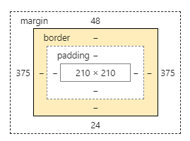
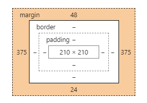

# CSS基础

## 盒模型

css盒模型分为**IE盒模型**和**W3C标准盒模型**。

W3C盒模型：属性width、height只包含内容content，不包含border和padding。

IE盒模型：属性width、height包含border和padding，指的是content+padding+border。

在浏览器中使用何种盒模型可以通过box-sizing控制。

box-sizing有3个值：

- content-box（默认值：标准盒模型）
- border-box（ie盒模型）
- inherit（从父元素继承）

在ie6-8中需要声明DOCTYPE，否则会触发ie模式。

**DOM在文档中的大小 = content + padding + border**

**DOM在文档中所占的空间 = content + padding + border + margin**

如何理解上面两个表达式呢？

即盒子的大小由content + padding + border决定，可以通过在浏览器中查看查看Styles来查看：

而盒子在文档流中所占的空间会因设置了margin而与实际盒子的大小不同。

所以，css盒模型容易混淆的概念其实是：

- width并不等于content，width是css属性，而content是css盒模型中内容的表示。
- DOM在文档中的大小与width并没有关系，而是content+padding+border。而DOM所占的空间还要加上margin。

## BFC

更新中。。。

<Vssue :title="$title" />
