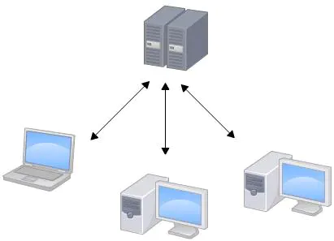
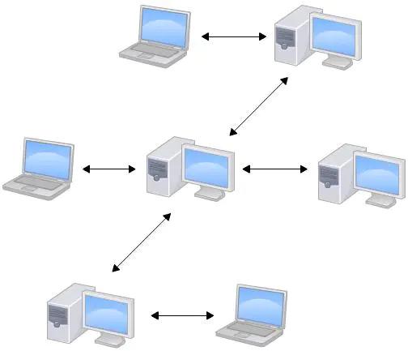

# Git配置和错误
<br >


> git是目前世界上最先进的分布式版本控制系统, 它由Linux的创始人Linus在2005年创建, 创建之初, Linus是为了解决Linux系统的代码管理问题, 由于Linux是开源的, 全世界的热心志愿者都可以编写Linux代码, 但是代码版本管理维护越来越困难, 因此, git诞生了.

### 集中式vs分布式



集中式版本控制系统的版本库是存放在中央服务器的, 编写代码时, 需要先从中央服务器`checkout`代码到本地, 编写完成后, 再把代码从本地`push`到中央服务器, 集中式版本控制系统最大的毛病就是必须联网才能工作, 在网络较差的地方或者没有网络那就没办法工作了.



而分布式版本控制系统是不存在所谓"中央服务器" 的, 每个人的电脑都是一个完整的版本库.  其实,为了方便交换大家的修改, 分布式版本控制系统也有一个充当"中央服务器"的电脑.
集中式版本控制系统的代表是`SVN`, `CVS`等.
分布式版本控制系统的代表就是我们今天的主角`GIT`了.

### git安装
安装过程很简单, 到[官网下载](//git-scm.com/downloads)安装包, 双击安装就可以了(我的电脑是window, 因此这个安装包也仅考虑到window64位版本), 安装成功后, 在任意文件夹下右键可以看到`git Bash`表明安装成功了.
安装完成后, 右键打开`git bash`设置本台机器使用`git`时用户的名称和邮箱
```js
$ git config --global user.name "Your Name"
$ git config --global user.email "email@example.com"
```
这个操作仅需要设置一次

### 创建版本库
```js
# 在当前目录新建一个Git代码库
$ git init

# 新建一个目录，将其初始化为Git代码库
$ git init [project-name]

# 下载一个项目和它的整个代码历史
$ git clone [url]
```

### 配置
在项目目录下可以通过常见.gitignore文件来设置配置规则
+ 空格不匹配任意文件，可作为分隔符，可用反斜杠转义
+ 以“＃”开头的行都会被 Git 忽略。即#开头的文件标识注释，可以使用反斜杠进行转义。
+ 以斜杠"/"开头表示目录；"/"结束的模式只匹配文件夹以及在该文件夹路径下的内容，但是不匹配该文件；"/"开始的模式匹配项目跟目录；如果一个模式不包含斜杠，则它匹配相对于当前 .gitignore 文件路径的内容，如果该模式不在 .gitignore 文件中，则相对于项目根目录。
+ 以星号"*"通配多个字符，即匹配多个任意字符；使用两个星号"**" 表示匹配任意中间目录，比如`a/**/z`可以匹配 a/z, a/b/z 或 a/b/c/z等。
+ 以问号"?"通配单个字符，即匹配一个任意字符；
+ 以方括号"[]"包含单个字符的匹配列表，即匹配任何一个列在方括号中的字符。比如[abc]表示要么匹配一个a，要么匹配一个b，要么匹配一个c；如果在方括号中使用短划线分隔两个字符，表示所有在这两个字符范围内的都可以匹配。比如[0-9]表示匹配所有0到9的数字，[a-z]表示匹配任意的小写字母）。
+ 以叹号"!"表示不忽略(跟踪)匹配到的文件或目录，即要忽略指定模式以外的文件或目录，可以在模式前加上惊叹号（!）取反。需要特别注意的是：如果文件的父目录已经被前面的规则排除掉了，那么对这个文件用"!"规则是不起作用的。也就是说"!"开头的模式表示否定，该文件将会再次被包含，如果排除了该文件的父级目录，则使用"!"也不会再次被包含。可以使用反斜杠进行转义。

**需要谨记：git对于.ignore配置文件是按行从上到下进行规则匹配的，意味着如果前面的规则匹配的范围更大，则后面的规则将不会生效；**

| 实例 | 解释 |
| :----: | ---- |
| # | 表示此为注释,将被Git忽略 |
| *.a | 表示忽略所有 .a 结尾的文件 |
| !lib.a | 表示但lib.a除外 |
| /TODO | 表示仅仅忽略项目根目录下的 TODO 文件，不包括 subdir/TODO |
| build/ | 表示忽略 build/目录下的所有文件，过滤整个build文件夹 |
| doc/*.txt | 表示会忽略doc/notes.txt但不包括 doc/server/arch.txt |
| bin/ | 表示忽略当前路径下的bin文件夹，该文件夹下的所有内容都会被忽略，不忽略 bin 文件 |
| /bin | 表示忽略根目录下的bin文件 |
| debug/*.obj | 表示忽略debug/io.obj，不忽略 debug/common/io.obj和tools/debug/io.obj |
| **/foo |  表示忽略/foo,a/foo,a/b/foo等 |
| a/**/b | 表示忽略a/b, a/x/b,a/x/y/b等 |
| !/bin/run.sh | 表示不忽略bin目录下的run.sh文件 |
| *.log | 表示忽略所有 .log 文件 |
| config.php | 表示忽略当前路径的 config.php 文件 |
| /mtk/ | 表示过滤整个mtk文件夹 |
| *.zip | 表示过滤所有.zip文件 |


### 常见错误

1. 用户名或密码错误, 项目好好地突然报错, 原来是在gitee上重新设置了邮箱地址造成的

``` git
$ git push origin master
remote: Incorrect username or password ( access token )
fatal: Authentication failed for 'https://gitee.com/gavin_d/xxxxxx.git/'
```

方法: 打开电脑的控制面板-> 用户账户 -> 管理windows凭证, 找到普通凭证中自己的帐号信息, 填入正确的用户名和密码保存即可

2. 404 Not Found , 修改了用户名后引发了很多问题

``` js
ERROR: Repository not found.
fatal: Could not read from remote repository.

 Please make sure you have the correct access rights
 and the repository exists.
```

方法: 输入`git remote set-url origin git@gitee.com:xxxxxx/xxxxxx.git`, 你的新仓库地址

3. git默认忽略文件名大小写因此无法监听到改变，~~需要运行`git config core.ignorecase false`禁止忽略大小写就可以监听到文件名改变了。~~（这个方法不推荐使用，在更新资源的时候会有问题。）好的方法是执行`git mv [oldfilename] [newfilename]`，此时文件为renamed状态，再提交就可以了。


<Vssue :title="$title" />
