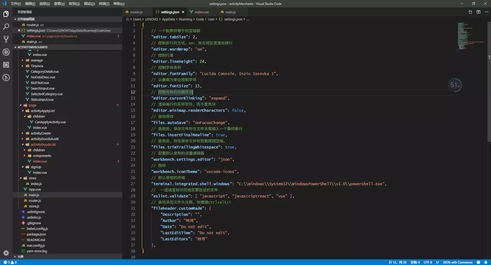

# 个人vscode插件和配置
<br/>

> vscode是一款非常好的编辑器, 它的好很大一部分取决于丰富的插件库, 由于安装的插件比较多, 配置也比较多(个人喜欢瞎弄), 这里做一个插件和配置的备份, 纯粹个人配置, 做个参考


### 插件
1. **Auto Close Tag**

    自动闭合HTML标签

2. **Beautify**

    美化javascript，JSON，CSS，Sass，和HTML在Visual Studio代码
    
3. **Better Comments**

    注释插件

4. **Bracket Pair Colorizer**
    
    允许使用颜色标识匹配的括号

5. **Chinese (Simplified) Language Pack for Visual Studio Code** 

    适用于 VS Code 的中文（简体）语言包
    
6. **Debugger for Chrome** 

    用于在Google Chrome浏览器或支持Chrome DevTools协议的其他目标中调试JavaScript代码的VS Code扩展
    
7. **ESLint**

    提高代码可读性、统一性，适合协作开发

8. **GitLens — Git supercharged**

    增强Visual Studio代码内置的Git功能
    
9. **Markdown Preview Enhanced**

    Markdown 预览
    
10. **npm**

    支持运行文件中定义的npm脚本package.json并根据定义的依赖项验证已安装的模块。
    
11. **npm Intellisense**

    在import语句中自动填充npm模块
    
12. **Path Intellisense**

    自动填充文件名
    
13. **Sass**

    scss插件
    
14. **Vetur**

    vue工具

15. **Vue 2 Snippets**

    vue 2.x 语法提示
    
16. **React-Native/React/Redux snippets for es6/es7**

    react 语法插件
    
17. **koroFileHeader**

    注释插件，为文件添加头部注释，适合协作开发


    
### 配置 (setting.json)

```json
{
    // 一个制表符等于的空格数
    "editor.tabSize": 2,
    // 控制折行的方式。on: 将在视区宽度处换行
    "editor.wordWrap": "on",
    // 控制行高
    "editor.lineHeight": 24,
    // 控制字体系列
    "editor.fontFamily": "Lucida Console, Lucida Sans Typewriter, Consolas, Monaco, Inziu Iosevka J",
    // 以像素为单位控制字号
    "editor.fontSize": 15,
    // 控制光标的动画样式
    "editor.cursorBlinking": "expand",
    // 渲染每行的实际字符，而不是色块
    "editor.minimap.renderCharacters": false,
    // 自动保存
    "files.autoSave": "onFocusChange",
    // 启用后，保存文件时在文件末尾插入一个最终新行
    "files.insertFinalNewline": true,
    // 启用后，将在保存文件时剪裁尾随空格。
    "files.trimTrailingWhitespace": true,
    // 配置默认使用的设置编辑器
    "workbench.settings.editor": "json",
    // 图标
    "workbench.iconTheme": "vscode-icons",
    // 默认使用的终端
    "terminal.integrated.shell.windows": "C:\\Windows\\System32\\WindowsPowerShell\\v1.0\\powershell.exe",
    //  一组语言标识符指定要验证的文件
    "eslint.validate": [ "javascript", "javascriptreact", "vue" ],
    // 自动添加文件头注释，快捷键ctrl+alt+i
    "fileheader.customMade": {
        "Description": "",
        "Author": "林河",
        "Date": "Do not edit",
        "LastEditTime": "Do not edit",
        "LastEditors": "林河"
    },
}
```

### 主题和图标
主题和图标网上有太多了, 我使用的是默认主题，还是这个耐看

效果图:



