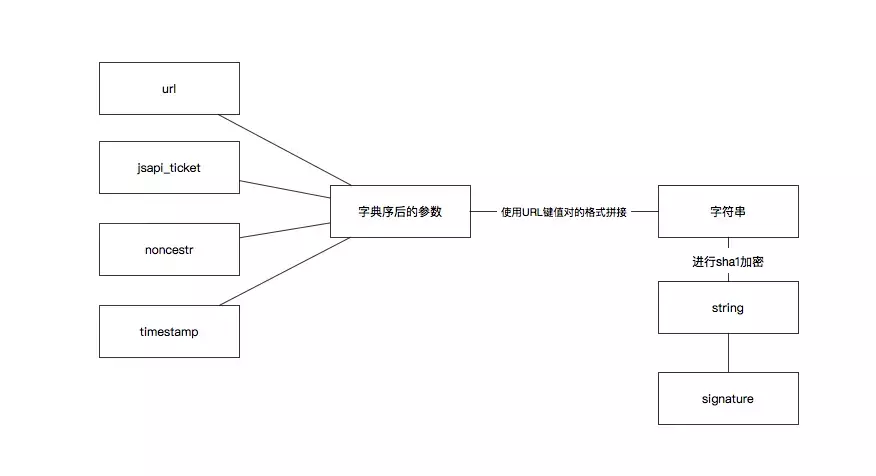

# 在第三方页面调用微信接口
<br >


> 这两天在做一个微信上的web项目, 项目很简单, 大部分是表单提交和验证的代码, 考虑到速度和基本样式, 选择用`vue` + `muse-ui`来做, 初稿很快就完成了, 然后到了老板提需求的阶段, 表示要在页面上做一个和微信扫一扫一样的功能来识别二维码读取二维码信息, 主要还是为了让用户减少表单输入的操作难度, 咋一听这怎么可能呢, 微信扫一扫是建立在app的基础上的, web页面是无论如何都无法调取原生应用还要修改原生应用更加不可能的啊, 除非利用`react native`或者`weex`, 偶然间同事跟我说起顺丰的扫一扫识别条码的功能, 是在公众号的web页面上实现的, 我拿来一看, 这是调的微信扫一扫的功能啊, 难不成微信还有内部的接口, 然后下面就是翻阅[微信公众平台文档js-sdk](https://mp.weixin.qq.com/wiki?t=resource/res_main&id=mp1421141115)的收获和一些坑

### 步骤
1. 进入文档映入眼前的及时js-sdk的文档目录, 包括概述, 使用步骤1234..., 调用说明等等, 很详细有木有, 看了才知道, 首先介绍一下js-sdk
> 通过使用微信JS-SDK，网页开发者可借助微信高效地使用拍照、选图、语音、位置等手机系统的能力，同时可以直接使用微信分享、扫一扫、卡券、支付等微信特有的能力，为微信用户提供更优质的网页体验。

官方原文, 功能还是很不错的

2. 绑定域名
首先设置JS接口的安全域名, 在"公众号设置"->"JS接口安全域名"里可以设置你将要调用接口的域名

3. 引入js文件
写文章的时候, 已经更新到了1.4.0[http://res.wx.qq.com/open/js/jweixin-1.4.0.js](http://res.wx.qq.com/open/js/jweixin-1.4.0.js), 在`vue`中引入可以引入它的npm包, 可以再[npm官网](https://www.npmjs.com/)搜索`weixin-js-sdk`, 或者直接使用`yarn add weixin-js-sdk`下载到项目中

4. 在页面加载时配置接口注入权限验证
```js
import wx from 'weixin-js-sdk';
export default {
  methods: {
    configWX() {
      this.$axios.get('api/xxx?url=' + location.href.split('#')[0])
        .then(res => {
          res = res.data
          // 配置
          wx.config({
            // 开启调试模式,调用的所有api的返回值会在客户端alert出来，若要查看传入的参数，
            // 可以在pc端打开，参数信息会通过log打出，仅在pc端时才会打印。
            debug: true,
            appId: 'your appId', // 必填，公众号的唯一标识
            timestamp: res.timestamp, // 必填，生成签名的时间戳
            nonceStr: res.nonceStr, // 必填，生成签名的随机串
            signature: res.signature,// 必填，签名
            jsApiList: [ 'scanQRCode' ] // 必填，需要使用的JS接口列表
          });
        })
        .catch(err => {
          alert('error: ' + err )
        })
    }
  },
  created() {
    this.configWX();
  }
}
```
官方的步骤就是这么下来的, 而且它用了特殊的文体叙述写法----倒序, 我开始也对于配置文件中的字段一脸懵B, 这些东西是从哪里来的啊, 因此, 上面代码有几点需要解释一下
+ 关于后台, 后台在用户进入这个页面之前, 已经通过调用微信的接口`https://api.weixin.qq.com/cgi-bin/token?grant_type=client_credential&appid=APPID&secret=APPSECRET`获取到了`access_token`, appid和secret可在"基本配置"->"公众号开发信息"中查询到相关信息, `access_token`这个字段是公众号的全局唯一接口调用凭据，公众号调用各接口时都需使用`access_token`


  | 参数 | 是否必须 | 说明 |
  | ------ | ------ | ------ |
  | grant_type | 是	| 获取access_token填写client_credential |
  | appid	| 是 | 第三方用户唯一凭证 |
  | secret | 是 | 第三方用户唯一凭证密钥，即appsecret |

  返回的格式如下:
  ```
  {"access_token":"ACCESS_TOKEN","expires_in":7200}
  ```
+ 用第一步拿到的`access_token` 采用`http GET`方式请求获得`jsapi_ticket`（有效期7200秒，开发者必须在自己的服务全局缓存`jsapi_ticket`）：`https://api.weixin.qq.com/cgi-bin/ticket/getticket?access_token=ACCESS_TOKEN&type=jsapi`, 获取`jsapi_ticket`时, `type`固定为`jsapi`, 获取到`jsapi_ticket`之后，就可以生成JS-SDK权限验证的签名了。关于签名算法官方有详细文档, 可自行查阅.
+ 签名完成之后基本就接近前端需要的数据了, 再来看一下前端需要什么
  ```
  appId: 'your appId', // 必填，公众号的唯一标识
  timestamp: res.timestamp, // 必填，生成签名的时间戳
  nonceStr: res.nonceStr, // 必填，生成签名的随机串
  signature: res.signature,// 必填，签名
  ```
  `appId`可以在公众号上查到, `timestamp`是时间戳, `nonceStr`是后台设置的随机串, `signature`就是签名了, 解释了还是一脸懵B有木有, 一图胜千言
 
  
  这下应该懂了, 后台的签名算法未必正确, 可以使用[微信JS接口签名校验工具](https://mp.weixin.qq.com/debug/cgi-bin/sandbox?t=jsapisign)检验.

+ `url`参数设置为`location.href.split('#')[0]`是为了考虑`vue`用户使用`hash`模式导致的问题, 我用的是`history`模式, 但是也有其他问题, 后面会讲

5. 我的项目是用户在点击按钮之后才调用扫一扫接口, 然而有些功能比如获取用户信息可能在已进入页面的时候就需要调用, 就会用到两个接口, 在`created`钩子中调用
```
wx.ready(function(){
    // config信息验证后会执行ready方法，所有接口调用都必须在config接口获得结果之后，config是一个客户端的异步操作，
    // 所以如果需要在页面加载时就调用相关接口，则须把相关接口放在ready函数中调用来确保正确执行。
    // 对于用户触发时才调用的接口，则可以直接调用，不需要放在ready函数中。
});
wx.error(function(res){
    // config信息验证失败会执行error函数，如签名过期导致验证失败，
    // 具体错误信息可以打开config的debug模式查看，
    // 也可以在返回的res参数中查看，对于SPA可以在这里更新签名。
});
```

6. 调用扫一扫
  在调用功能之前, 最好验证一下接口的可用性
  ```
  wx.checkJsApi({
    jsApiList: ['scanQRCode'], // 需要检测的JS接口列表，
    success: function(res) {
      // 以键值对的形式返回，可用的api值true，不可用为false
      // 如：{"checkResult":{"chooseImage":true},"errMsg":"checkJsApi:ok"}
    }
  });
  ```
  ```
  wx.scanQRCode({
    needResult: 0, // 默认为0，扫描结果由微信处理，1则直接返回扫描结果，
    scanType: ["qrCode","barCode"], // 可以指定扫二维码还是一维码，默认二者都有
    success: function (res) {
      var result = res.resultStr; // 当needResult 为 1 时，扫码返回的结果
    }
  });
  ```

7. 在config中将`debug`设置为`true`, 在移动端会以弹窗形式弹出`debug`的信息, 我遇到过诸如签名错误, 缓存问题, 兼容问题等引发的一系列问题, 这里坑确实不少, 但是因为没做笔记, 先前的问题大多难以还原, 这里粗略记下两个
  + android可以调用, ios却调不了, 开启`debug`后提示`the permission value is offline verifying`, 网上各种说法都有, 我不确定正确, 但我的确实不是他们说的问题, 我的问题产生的原因是部分ios版本不支持`pushState`, 而我恰巧使用了它, 似乎牵扯到`KWwebview`和`UIwebview`, 我不是很懂, 不过官方有[介绍](https://mp.weixin.qq.com/wiki?t=resource/res_main&id=mp1483682025_enmey), 我只需要把所有引入当前调用页面的`router-link`全部替换成a标签即可.
  + 还有签名错误问题, 配合开发是需要很大的沟通成本的, 幸好有[微信JS接口签名校验工具](https://mp.weixin.qq.com/debug/cgi-bin/sandbox?t=jsapisign), 这个东西还是很不错的, 为开发者确实解决了很多沟通问题

### 题外
+ 还有部分ios上的兼容问题, 比如我在`vue`中使用`scss`作为扩展语言, 在设置`muse-ui`的组件内样式时, 有时会用到穿透语法`/deep/`, 导致我的样式失效, 删除`/deep/`就好了, 如果设置组件样式不成功, 则新建一个`.scss`文件, 在`main.js`中导入即可

以上就是在微信公众号上搭建一个简单表单项目的心得, 共同进步


<Vssue :title="$title" />
